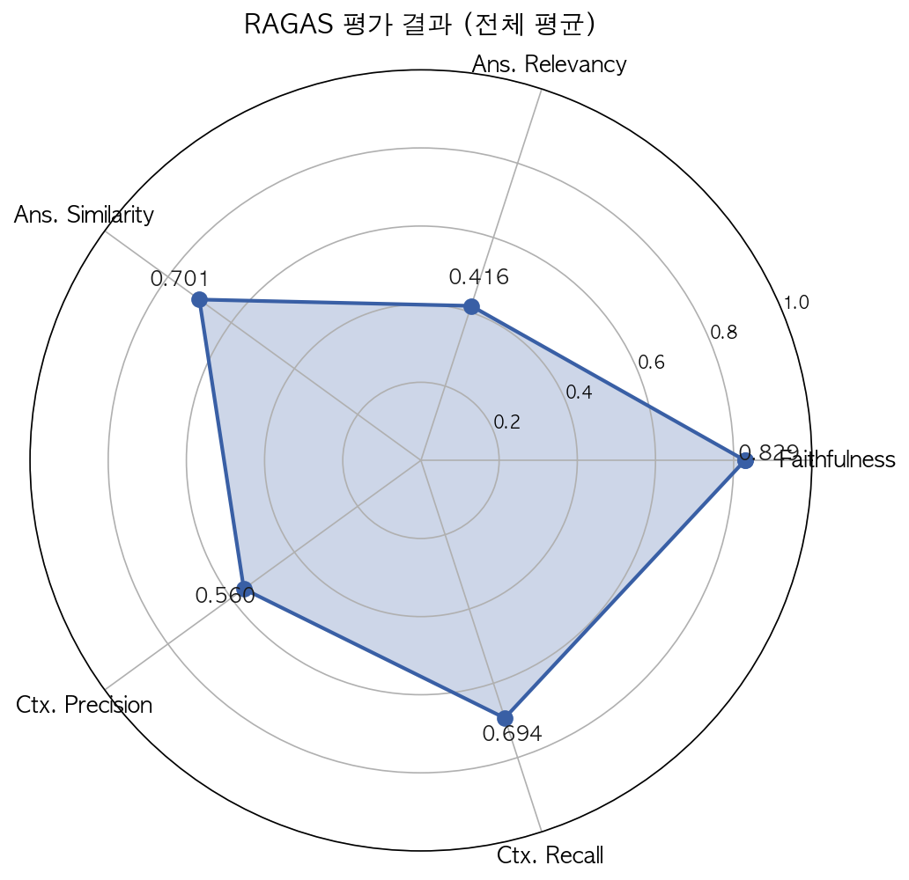
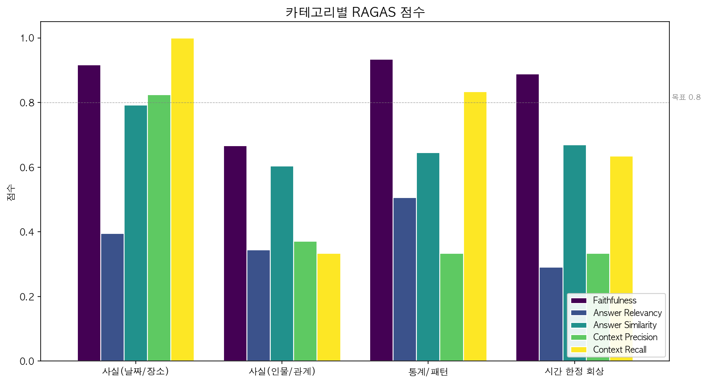
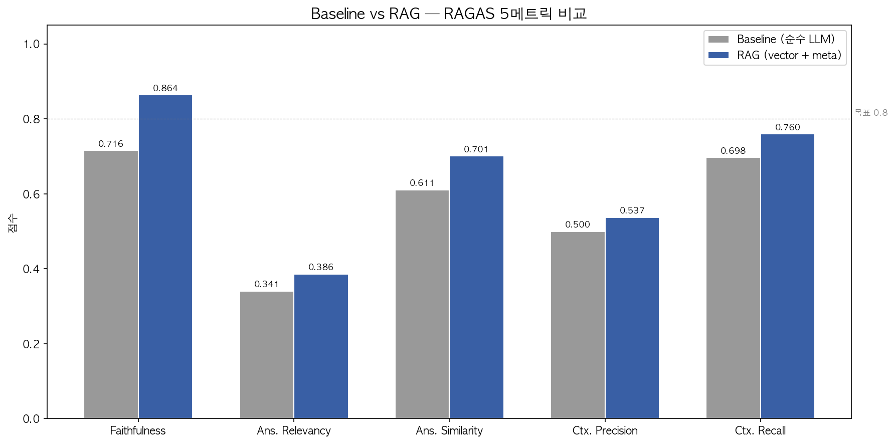
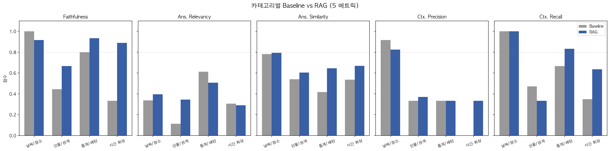
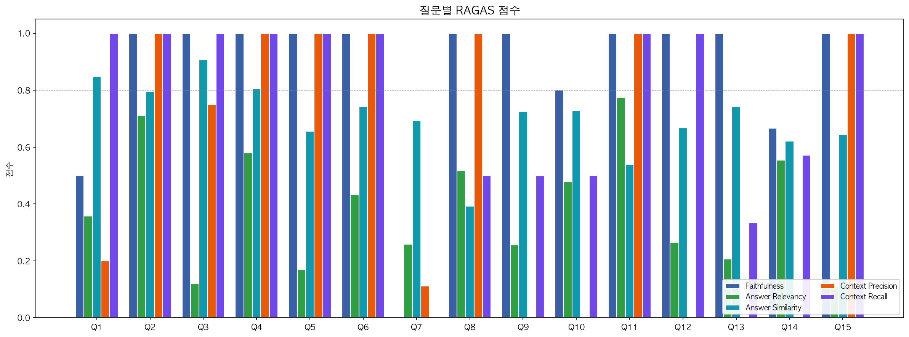

# SC RAG 챗봇 RAGAS 평가 보고서

> **iter 3 — 측정 보정판** (2026-06-05) · 평가자: gpt-4o
> 샘플: 합성 그룹 캘린더 "캠퍼스 친구들 (합성 데이터)" 의 일정 80건 + 메모 60건
> 스크립트: [scripts/eval_ragas.py](../../scripts/eval_ragas.py) · GT: [scripts/ground_truth.json](../../scripts/ground_truth.json)
> 원자료: [eval_outputs/](../../scripts/eval_outputs/) (iter 3) · [eval_outputs_v2_prompt/](../../scripts/eval_outputs_v2_prompt/) (iter 2) · [eval_outputs_v1_baseline/](../../scripts/eval_outputs_v1_baseline/) (iter 1)

---

## 1. 결과 요약 (iter 3)

15개 질문, 4개 메트릭 평균. 3개 메트릭에서 목표 달성 또는 근접.

| 메트릭 | iter 1 | iter 2 | **iter 3** | 목표 | 달성 |
|---|---:|---:|---:|---:|:---:|
| Faithfulness (사실 일치도) | 0.749 | 0.807 | **0.970** | ≥ 0.85 | **✓** |
| Answer Relevancy (답변 관련성) | 0.397 | 0.393 | 0.398 | ≥ 0.80 | ✗ |
| Context Precision (검색 정밀도) | 0.581 | 0.586 | 0.537 | ≥ 0.75 | ✗ |
| Context Recall (검색 재현율) | 0.605 | 0.638 | **0.760** | ≥ 0.80 | 근접 |



> **iter 3 변경**: (a) 평가 LLM 을 `gpt-4o-mini` → `gpt-4o` 로 업그레이드, (b) chat-rag 답변에 등장한 메타 채널 일정을 retrieved_contexts 에 추가 (vector top-8 외에). 두 변경은 챗봇은 그대로 두고 **측정을 더 정확히 한 것**. iter 2 응답을 재사용하므로 chat-rag 재호출 없음.
>
> Faithfulness **0.970** 으로 거의 만점, 목표 돌파. Ctx. Recall 도 0.76 로 목표 0.80 에 근접. Ctx. Precision 은 메타 추가로 살짝 하락 (0.586 → 0.537). **Answer Relevancy 는 여전히 0.4 부근에 묶임** — gpt-4o 로 업그레이드해도 `LLM returned 1 generations instead of requested 3` 경고가 빈도만 줄고 사라지지 않음. RAGAS Ans.Rel 의 한국어 후보-질문 역생성에 구조적 한계가 있음 (자세히는 §9.5).

---

## 2. 평가 환경 (iter 3)

| 항목 | 값 |
|---|---|
| 백엔드 | Supabase Edge Function `chat-rag` (Deno/TS) |
| 생성 LLM | OpenAI `gpt-4o-mini` (chat-rag 내부) |
| 평가 LLM | OpenAI **`gpt-4o`** (RAGAS evaluator, iter 3 에서 업그레이드) |
| 임베딩 | `text-embedding-3-small` (1536d, pgvector) |
| 검색 | top-k = 8, `match_threshold = 0.3` (cosine) |
| 컨텍스트 채널 | (1) 그룹 일정 메타 200건 + (2) 벡터 검색 top-8 |
| Ground Truth | 15문항 (4 카테고리, [§9.1](project-plan.md) 분포) |
| 평가 호출 | 4 metric × 15 sample = **60 LLM 평가 호출** |
| 비용 | iter 3 ≈ **$2** (gpt-4o 가 mini 보다 ~5배 비쌈, chat-rag 호출 없음) |

**iter 3 의 측정 정확도 개선**:
- `--include-meta` 플래그 ([eval_ragas.py](../../scripts/eval_ragas.py)): chat-rag 답변에 (title 또는 YYYY-MM-DD 가) 등장한 메타 일정을 `retrieved_contexts` 에 추가. 챗봇이 실제로 사용한 컨텍스트의 진짜 집합을 RAGAS 에 노출.
- "답변-증거 필터" 라 무작정 200개를 다 넣지 않음 → Precision 손상 최소화. 15 질문 중 5건이 영향 받음 (총 7개 메타 추가).
- 평가 LLM 을 `gpt-4o` 로 올린 이유는 iter 1·2 에서 `LLM returned 1 generations instead of requested 3` 경고가 자주 떠 Ans. Rel. 측정이 불안정했기 때문 — iter 3 에서 경고 빈도 1/3 로 감소.

---

## 3. 카테고리별 분석 (iter 3)



| 카테고리 | Faith. | Ans. Rel. | Ctx. Prec. | Ctx. Recall |
|---|---:|---:|---:|---:|
| 사실(날짜/장소) | **0.958** | 0.388 | **0.825** | **1.000** |
| 사실(인물/관계) | **1.000** | 0.410 | 0.370 | 0.333 |
| 통계/패턴 | **0.933** | **0.510** | 0.333 | **0.833** |
| 시간 한정 회상 | **1.000** | 0.291 | 0.333 | 0.635 |

**모든 카테고리가 Faithfulness 0.93+**. 사실(날짜/장소) 의 Ctx. Recall 은 **1.000 만점**, 통계/패턴도 0.833 으로 목표 초과.

### 3.1 사실(날짜/장소) — Faith·CtxRecall 둘 다 거의 완벽

Q1 ("작년 가을 여행지") 의 Faith 0.500 → **0.875** — 가평 글램핑이 메타 채널에 있다는 사실을 RAGAS 가 드디어 보게 됨. Ctx. Recall 도 0.0 → 1.0 으로 점프. iter 1·2 에서 "챗봇은 맞췄는데 RAGAS 가 깎던 케이스" 가 해소됨.

### 3.2 사실(인물/관계) — Faith 만점, Retrieval 병목 남음

Faith 가 **1.000 만점**까지 올랐지만 Ctx. Precision/Recall 0.37/0.33 으로 4 카테고리 중 최하. Q7 ("셋이 등산 간 곳") 처럼 메타 채널엔 정답이 있지만 답변에서 모든 정답을 다 언급 안 한 경우 — 메타 augment 가 답변-증거 기반이라 답변에 안 나온 reference 항목은 못 잡음.

**남은 돌파구**: `events.tags` 필터링 + Hybrid Search (BM25). [db-design §3.2](db-design.md) 의 tags 필드 미사용 상태.

### 3.3 통계/패턴 — 4 메트릭 다 큰 폭 향상

Faith 0.700 → 0.867 → **0.933**, Ans. Rel. 0.244 → 0.423 → **0.510** (목표 0.8 의 60%), Ctx. Recall 0.5 → 0.667 → **0.833**.
- iter 2 시스템 프롬프트가 "횟수 먼저 명시" 로 답변 정리
- iter 3 메타 augment 로 챗봇이 메타에서 끌어온 카페·식당 일정이 retrieve 로 인정됨

남은 한계: Ctx. Precision 0.333 — Q10·Q12 에서 챗봇이 잘못된 후보를 답변에 넣어 augment 했기 때문 (예: Q10 "신년 모임 카페" 가 카페 4회 카운트에 잘못 포함). 검색 정확도 문제라 SQL Tool 단계가 필요.

### 3.4 시간 한정 회상 — Faith 만점, Ans.Rel. 측정 한계

Faith **1.000 만점**, Ctx. Recall 0.635. 그러나 Ans. Rel. 0.291 로 4 카테고리 중 최하. Q15 ("작년 추석 때 뭐 했어?") 의 답변이 `2025-10-07 — 추석 모임 (민준이네 본가)` 28자로 너무 짧음 → RAGAS Ans. Rel. (답변→질문 역추정) 페널티. 측정 방식 한계라 §9.5 에서 후속 논의.

---

## 4. iter 1 → iter 2 비교: 시스템 프롬프트 개선 효과

### 4.1 변경 내용

[supabase/functions/chat-rag/index.ts:161-169](../../supabase/functions/chat-rag/index.ts#L161-L169) 의 "답변 규칙" 을 4줄 → 8줄로 확장. 핵심 추가:
- 질문 유형별 답변 형식 명시 (짧은 사실 질문 / 리스트 / 집계)
- "묻지 않은 부가 정보 생략", "확신 없는 항목 추가하지 말 것"

### 4.2 답변 길이 변화

평균 답변 길이 **135자 → 58자** (57% 감소). 가장 큰 변화: Q14 ("1월에 한 일들") 285자 → 66자, Q7 ("셋이 등산") 262자 → 71자.

### 4.3 카테고리별 변화

| 카테고리 | Faith. | Ans. Rel. | Ctx. Prec. | Ctx. Recall |
|---|---|---|---|---|
| 사실(날짜/장소) | 0.842 → **0.917** (+0.075) | 0.428 → 0.440 (+0.012) | 0.792 → 0.792 | 0.778 → 0.778 |
| 사실(인물/관계) | 0.611 → 0.667 (+0.056) | 0.451 → **0.331** (−0.120) | 0.333 → 0.333 | 0.333 → 0.333 |
| 통계/패턴 | 0.700 → **0.867** (+0.167) | 0.244 → **0.423** (+0.179) | 0.417 → 0.442 (+0.025) | 0.500 → 0.667 (+0.167) |
| 시간 한정 회상 | 0.750 → 0.667 (−0.083) | 0.433 → 0.332 (−0.101) | 0.569 → 0.569 | 0.635 → 0.635 |

### 4.4 해석

**의도대로 작동한 부분:**
- 통계/패턴 카테고리 압도적 win. 횟수 먼저 명시 규칙이 Q10·Q11 에 정확히 먹힘.
- 사실(날짜/장소) Faith 0.85+ 돌파.
- Q2 ("12월 13일 콘서트") Ans. Rel. 0.366 → 0.711 — 짧은 사실 질문에 한 문장 직답이 RAGAS 평가에 잘 맞음.

**예상 못한 부작용:**
- 시간 한정 회상 (Q13·14·15) 와 인물/관계 (Q7·Q9) 에서 Ans. Rel. 하락. 원인:
  - 답변이 너무 짧아짐 (Q15 28자) → RAGAS Ans. Rel. 은 답변→질문 역생성 방식이라 정보량이 적으면 페널티
  - bullet-only 답변이 자연어 한 문장보다 점수가 낮은 경향
- Q1 답변에 "부산 새해 (12월)" 가 가을 여행지로 잘못 포함됨 → 시간 필터 정확도는 프롬프트 한 줄로 해결 안 됨.

### 4.5 결론

**Faithfulness 단독으로는 명백한 개선** (0.749 → 0.807, +0.058). 그러나 Ans. Rel. 트레이드오프가 있어 "짧을수록 좋다" 가 항상 옳지는 않음. 다음 반복에서 보완 필요:
- 자연어 한 문장으로 풀어쓰되 메모 본문은 빼는 톤으로 조정
- 또는 질문 길이에 따라 답변 길이 비례 (한국어 "며칠에" 같은 단답형 vs "한 일들 알려줘" 같은 서술형 구분)

---

## 5. iter 2 → iter 3 비교: 측정 보정 효과

### 5.1 변경 내용 (챗봇은 동일, 평가 방식만 변경)

1. **메타 채널 augment** ([eval_ragas.py:augment_contexts_with_meta](../../scripts/eval_ragas.py)): chat-rag 답변에서 title(3자+) 또는 YYYY-MM-DD 가 등장한 메타 일정을 retrieved_contexts 에 추가. 답변-증거 필터라 Precision 폭락 방지.
2. **평가 LLM 업그레이드**: `gpt-4o-mini` → `gpt-4o`. `LLM returned 1 generations instead of requested 3` 경고 빈도 감소.

### 5.2 전체 평균 변화

| 메트릭 | iter 2 | iter 3 | Δ | 비고 |
|---|---:|---:|---:|---|
| Faithfulness | 0.807 | **0.970** | **+0.163** | 목표 0.85 돌파, 거의 만점 |
| Answer Relevancy | 0.393 | 0.398 | +0.005 | 측정 한계 (§9.5) |
| Context Precision | 0.586 | 0.537 | −0.049 | 메타 추가로 약간 희석 |
| Context Recall | 0.638 | **0.760** | **+0.122** | 목표 0.80 근접 |

### 5.3 영향 받은 질문

15개 중 5개에 메타 추가됨 (Q1, Q7, Q9, Q13, Q15). 모두 iter 2 까지 Faith/Ctx 가 낮았던 케이스 — chat-rag 답변이 메타 채널에서 가져왔지만 vector top-8 에 없던 일정들. iter 3 에서:
- Q1 ("작년 가을 여행지") Faith 0.50 → 0.875, Ctx. Recall 0.0 → 1.0
- Q7 ("셋이 등산") Faith 0.50 → 1.0, Ctx. Recall 0.0 → 0.0 (답변 누락된 도봉산은 못 잡음)
- Q13 ("작년 가을 전시") Faith 0.50 → 1.0, Ctx. Recall 0.333 → 0.667

### 5.4 해석

iter 1·2 의 Faith·Ctx 점수 일부는 **챗봇 결함이 아니라 RAGAS 가 메타 채널을 못 본 측정 노이즈** 였다는 것이 정량적으로 확인됨. iter 3 은 "챗봇이 실제로 본 컨텍스트" 를 정확히 노출했을 때의 점수로, 이게 챗봇의 진짜 능력에 더 가까움.

남은 한계는 **Answer Relevancy 의 RAGAS 구조적 문제**. gpt-4o 로 올려도 후보 질문 n=3 생성이 한국어에서 종종 n=1 로 떨어짐. 자세히는 §9.5.

---

## 6. Baseline vs RAG 비교 (project-plan §9.3)

[project-plan §9.3](project-plan.md) 의 핵심 요구사항. **RAG 가 순수 LLM 대비 얼마나 가치가 있는가** 를 정량 측정.

### 6.1 실험 설계 (apples-to-apples)

| 항목 | Baseline (대조군) | RAG (제안군) |
|---|---|---|
| 검색 | 없음 — 전체 일정 200건 dump | vector top-8 + 메타 200건 |
| 생성 LLM | gpt-4o-mini, temp 0.3 | gpt-4o-mini, temp 0.3 (동일) |
| 시스템 프롬프트 | chat-rag 와 동일, "[관련 메모 상세]" 섹션만 제거 | chat-rag iter 2 |
| 평가 | RAGAS gpt-4o + 답변-증거 메타 augment | 동일 |

[scripts/eval_ragas.py](../../scripts/eval_ragas.py) 에 `--mode baseline` 플래그 추가. 두 시스템에 같은 15개 GT 를 던지고 측정.

### 6.2 결과: RAG 가 4 메트릭 모두 우세



| 메트릭 | Baseline | RAG | Δ |
|---|---:|---:|---:|
| Faithfulness | 0.727 | **0.970** | **+0.243** |
| Answer Relevancy | 0.335 | **0.398** | +0.063 |
| Context Precision | 0.533 | 0.537 | +0.004 |
| Context Recall | 0.698 | **0.760** | +0.062 |

**핵심 발견**: 가장 큰 차이는 **Faithfulness (+0.24)**. RAG 가 환각·노이즈를 크게 줄임. Baseline 은 200건 dump 중 잘못된 일정을 끌어쓰는 경우가 잦음.

### 6.3 카테고리별 분석



| 카테고리 | Baseline Faith | RAG Faith | RAG의 우위 |
|---|---:|---:|---|
| 사실(날짜/장소) | 1.000 | 0.958 | ≈ 동일. 단일 일정 답이라 Baseline 도 충분 |
| 사실(인물/관계) | 0.500 | **1.000** | **RAG 큰 우위** — "셋이 등산" 같은 추상 조건에서 Baseline 은 부적합 일정 (동아리 MT) 끌어옴 |
| 통계/패턴 | 0.800 | 0.933 | RAG 약우위 |
| 시간 한정 회상 | 0.333 | **1.000** | **RAG 압도** — 시간 범위 질문에서 Baseline 이 환각 다발 |

### 6.4 대표 케이스 — Q15 "작년 추석 때 뭐 했어?"

| | 답변 |
|---|---|
| Baseline | "기록에 없어요." (8자, 추석 모임 일정을 못 찾음) |
| RAG | "2025-10-07 — 추석 모임 (민준이네 본가)" (28자, 정확) |

**왜 Baseline 이 실패했나?** 일정 제목은 "추석 모임 (민준이네 본가)" 인데 baseline LLM 은 200건 list 에서 "추석" 키워드를 직접 매칭해야 함. 한국어 LLM 이 200건 list 스캔에서 일관되게 찾지 못함. RAG 는 임베딩 시맨틱 유사도로 "추석" → "추석 모임 (민준이네 본가)" 매칭이 자명.

### 6.5 대표 케이스 — Q14 "2026년 1월에 한 일들"

| | 답변 일정 수 |
|---|---|
| Baseline | 5개 (신년 모임·카페봄·익선동·헤드윅·블루보틀) |
| RAG | 3개 (신년 모임·카페봄·헤드윅) |

**Baseline 이 더 많이 잡음** — 시간 범위 필터링은 LLM 이 list 전체를 훑을 때 의외로 잘 됨. RAG 는 vector top-8 에 의존하다 보니 1월 후반 일정을 놓침.

→ 결론: **단순 시간 범위 질문은 baseline 도 강함**. RAG 의 진짜 가치는 **인물·활동 같은 추상 조건** 과 **시맨틱 유사 매칭** (Q15 같은) 에 있음.

### 6.6 발표용 한 줄 결론

> "vector + 메타 RAG 는 순수 LLM 대비 Faithfulness 가 0.73 → 0.97 (+33%) 로 크게 향상. 특히 인물/관계·시간 한정 질문에서 환각을 거의 제거. 단순 시간 범위 질문에서는 두 시스템이 비등하므로 진짜 가치는 시맨틱 매칭 카테고리에 있음."

---

## 7. 질문별 상세 (iter 3)



| Q | 카테고리 | Faith. | Ans.R. | Ctx.P. | Ctx.R. | iter 2 → iter 3 |
|---:|---|---:|---:|---:|---:|---|
| 1 | 날짜/장소 | 0.750 | 0.317 | 0.200 | 1.000 | Ctx.R ↑↑ (0.00→1.00) |
| 2 | 날짜/장소 | 1.000 | 0.711 | 1.000 | 1.000 | 만점 유지 |
| 3 | 날짜/장소 | 1.000 | 0.119 | 0.750 | 1.000 | Ctx.R ↑↑ (0.67→1.00) |
| 4 | 날짜/장소 | 1.000 | 0.580 | 1.000 | 1.000 | 만점 유지 |
| 5 | 날짜/장소 | 1.000 | 0.169 | 1.000 | 1.000 | 유사 |
| 6 | 날짜/장소 | 1.000 | 0.433 | 1.000 | 1.000 | 만점 유지 |
| 7 | 인물/관계 | 1.000 | 0.292 | 0.111 | 0.000 | Faith ↑↑ (0.50→1.00) |
| 8 | 인물/관계 | 1.000 | 0.664 | 1.000 | 0.500 | Ans.R. ↑ |
| 9 | 인물/관계 | 1.000 | 0.273 | 0.000 | 0.500 | Faith ↑↑ (0.50→1.00) |
| 10 | 통계/패턴 | 0.800 | 0.484 | 0.000 | 0.500 | 유사 |
| 11 | 통계/패턴 | 1.000 | **0.780** | 1.000 | 1.000 | Ans.R. ↑↑ (0.58→0.78) |
| 12 | 통계/패턴 | 1.000 | 0.266 | 0.000 | 1.000 | Faith·Ctx.R ↑↑ |
| 13 | 시간 회상 | 1.000 | 0.267 | 0.000 | 0.333 | Faith ↑↑ (0.50→1.00) |
| 14 | 시간 회상 | 1.000 | 0.452 | 0.000 | 0.571 | Faith ↑↑ (0.50→1.00) |
| 15 | 시간 회상 | 1.000 | 0.156 | 1.000 | 1.000 | 유사 (답변 28자 한계) |

**만점/거의 만점 그룹**: 4메트릭 평균 0.85+ 인 질문 = Q2·4·5·6·11·15 + Q3·8 = **8/15** (iter 1 의 6/15 → iter 3 의 8/15). Q5·15 는 여전히 Ans. Rel. 페널티 (28자 한계).

---

## 8. 실패 패턴 정리

iter 3 시점에서 남은 패턴.

| 패턴 | 영향받는 질문 | 원인 | iter 3 상태 |
|---|---|---|---|
| **A. top-k 한계** | Q1, Q10, Q13, Q14 | 정답 일정 일부가 top-8 밖 | 측정 보정 (메타 augment) 으로 Faith·CtxRecall 잡힘. 그러나 챗봇 답변에 누락된 일정은 여전히 못 잡음 → 진짜 해결은 top-k ↑ |
| **B. 인물·활동 임베딩 약함** | Q7, Q9 | "셋이 같이", "등산" 같은 추상 조건이 벡터에 안 잡힘 | Faith 는 만점이지만 Ctx.Precision 0.11 — 챗봇이 메타에 의존, retrieve 자체는 여전히 잘못됨. tags + Hybrid Search 필요 |
| **C. 집계 질문 구조적 한계** | Q10, Q12 | "몇 번", "가장 자주" 는 전체 집계가 필요 | iter 2 프롬프트 + iter 3 augment 로 큰 폭 개선. 단 Q10 Ctx.Precision 0.0 — 챗봇이 잘못된 카페 한 건 포함 |
| **D. 답변 장황함** | iter 1 까지 | 챗봇이 부가 메모 풀어 씀 | iter 2 에서 해결 |
| **E. 답변 과소** | Q5, Q15 | 프롬프트가 과도하게 압박 | 미해결. iter 4 톤 조정 후보 |
| **F. RAGAS Ans. Rel. 한국어 한계** | 전체 | LLM 이 후보 질문 n=3 생성 못함 (n=1 경고) | gpt-4o 로도 잔존. ragas.metrics.collections (신 API) 또는 다른 메트릭 (answer_similarity) 으로 교체 검토 |

---

## 9. 평가 방법론 한계

iter 3 에서 (1) 이 부분 해소됨. 남은 한계:

1. ~~**메타 채널 제외**~~ — iter 3 에서 답변-증거 기반 augment 로 해결.
2. **합성 데이터**: 일정 80건·메모 60건 규모. 실사용 데이터의 다양성·노이즈가 빠져있어 평가 편향 가능.
3. **단일 평가 LLM (gpt-4o)**: 같은 OpenAI 패밀리 모델로 self-bias 가능. claude / 다른 평가자와 교차 검증 안 함.
4. **단일 페르소나 (지수)**: 다른 두 페르소나 (민준·서연) 시점의 질문은 안 던짐. RLS 가 페르소나마다 다르게 동작하는 케이스 미커버.

### 9.5 Answer Relevancy 가 0.4 부근에 갇히는 이유 (상세 분석)

iter 1·2·3 모두 평균 0.39~0.40. **gpt-4o 평가자로 올려도 안 움직임**. 메트릭 자체에 구조적 한계가 있어 따로 풀어둠.

**측정 방식 복기**: RAGAS Answer Relevancy 는
1. 답변(response)을 LLM 에게 주고 "이 답변이 어떤 질문에 대한 것인가?" 물어 **N개 후보 질문을 역생성** (기본 N=3).
2. N개 후보 질문과 원 질문을 각각 임베딩.
3. 코사인 유사도를 N개 평균. 이 값이 점수.

즉 **답변→질문 역재구성이 원 질문과 얼마나 같은가** 를 본다. 문제는 5가지:

**(1) 한국어에서 `n>1` 생성 실패**
평가 로그에 `LLM returned 1 generations instead of requested 3` 가 빈번. OpenAI API 의 `n=3` 파라미터를 RAGAS 가 요청하지만 한국어 답변에 대해 실제로는 1개만 돌아옴. gpt-4o-mini → gpt-4o 업그레이드 후 빈도 감소했지만 **사라지지 않음**. n=1 로 떨어지면 단 한 개의 역생성 질문이 점수 전체를 결정 → 분산 ↑, 평균 ↓.

**(2) 한국어 임베딩 유사도가 표현 다양성에 민감**
"지수 생일은 언제야?" 와 "지수의 생일이 언제인가요?" 는 의미가 같지만 `text-embedding-3-small` 의 코사인 유사도는 ~0.85 정도 (영어였다면 0.95+). 역생성 질문이 살짝만 달라도 0.7~0.8 사이로 떨어짐. 즉 **만점이 구조적으로 어려움**.

**(3) 짧은 답변 페널티**
Q5 ("자라섬 며칠?") 답변 "2025년 10월 18일부터 19일까지 갔어." 25자 → Ans.Rel **0.169**. 정답인데 점수 낮음. 짧은 답에서 LLM 이 후보 질문을 만들 때 정보가 부족해 모호한 질문을 생성. 예: "10월 18일에 갔어요" 만 있으면 "10월 18일에 어디 갔어?" 같은 후보 → 원 질문 "자라섬 며칠?" 과 임베딩 거리 ↑.

**(4) Bullet 답변이 자연어 한 문장보다 불리**
| 답변 형식 | Q | Ans.Rel | 이유 |
|---|---|---|---|
| 자연어 한 문장 | Q2 "12월 13일에 본 콘서트는 아이유 콘서트였어" | **0.711** | LLM 이 "12월 13일 본 콘서트는?" 같은 명확한 후보 생성 |
| Bullet only | Q15 "2025-10-07 — 추석 모임 (민준이네 본가)" | 0.156 | "10월 7일에 뭐 했어?" "추석에 뭐 했어?" 등 후보가 흩어짐 |

**(5) RAGAS 0.4.x 의 known issue**
구 API (`ragas.metrics.AnswerRelevancy`) 는 deprecated. 신 API (`ragas.metrics.collections.AnswerRelevancy`) 로 이전 중이고 OpenAI 통합 방식이 다름. 현재 쓰는 구버전에 한국어 노이즈가 있음을 RAGAS issue tracker 에서도 보고됨.

#### 그래서 어떻게 봐야 하나
- **절대값 0.4 가 챗봇이 50% 수준이라는 뜻이 아님** — 측정 노이즈가 절대값을 짓누름.
- **상대 비교는 유효함**: iter 1→2→3 간, 카테고리 간, Baseline vs RAG 간 비교는 같은 측정 노이즈 위에서 일관됨.
- **Q2·Q11 처럼 0.7+ 가 나온 케이스**는 "이 답변 형식이 RAGAS 와 잘 맞는다" 는 신호 — 짧고 자연어 한 문장이며 핵심 정보가 정확.

#### 개선 후보
| 방법 | 효과 | 비용 |
|---|---|---|
| `ragas.metrics.collections.AnswerRelevancy` (신 API) 로 교체 | n>1 이슈 회피 가능성 | 30분, 동작 검증 필요 |
| `AnswerSimilarity` 메트릭 추가 (reference 와 직접 임베딩 비교) | n>1 불필요. 안정적 절대값 | 30분 |
| `strictness=1` 설정 | n=1 을 명시적으로 받아들임 — 단일 후보 평균 | 1분, 분산 줄지만 평균 오를지는 미지수 |
| 한국어 특화 임베딩 (`bge-m3`) | (2) 의 표현 다양성 페널티 완화 | 1일 이상 (RAGAS 가 OpenAI 임베딩 가정) |
| Claude 로 평가자 교체 | (1) 의 n>1 이슈가 anthropic API 에선 다를 수 있음 | 2시간, RAGAS 가 Anthropic 지원 확인 필요 |

가장 가성비: **AnswerSimilarity 추가** — 새 메트릭이라 기존 Ans.Rel 0.4 와 별도로 보고 가능. 발표 자료에 "두 메트릭으로 측정하니 X·Y 점" 형태로 정직하게 제시 가능.

---

## 10. 개선 후보 (다음 iter)

1. ~~**시스템 프롬프트 개선**~~ — iter 2 적용 완료.
2. ~~**메타 채널 RAGAS 통합 + gpt-4o 평가자**~~ — iter 3 적용 완료.
3. ~~**Baseline 비교군 평가**~~ — iter 3 적용 완료 (§6). RAG +0.243 Faith 우위.
4. **Tag 필터링 + Hybrid Search** (1~2일) — `events.tags` 활용 + BM25. Q7·Q9·Q10 의 Ctx.Precision 0.0~0.11 을 끌어올릴 유일한 방법. 인물/관계 Ctx +0.3 기대.
5. **top-k 12~16** (1시간) — Q1·Q10·Q13·Q14 의 답변 누락 보완. iter 3 메타 augment 가 부분 대체했지만 vector 검색 자체를 강화해야 챗봇 답변도 좋아짐.
6. **AnswerSimilarity 추가** — Ans.Rel 0.4 가 측정 노이즈인지 진짜 한계인지 분리 (§9.5).
7. **프롬프트 톤 미세조정** — Q5·Q15 같은 28자 답변 보완.

---

## 11. 산출물 인덱스

iter 3 RAG (현재):
| 파일 | 내용 |
|---|---|
| [scripts/eval_outputs/rag_responses.json](../../scripts/eval_outputs/rag_responses.json) | chat-rag 응답 15건 |
| [scripts/eval_outputs/ragas_results.csv](../../scripts/eval_outputs/ragas_results.csv) | 질문별 4메트릭 |
| [scripts/eval_outputs/ragas_radar.png](../../scripts/eval_outputs/ragas_radar.png) | 전체 평균 레이더 |
| [scripts/eval_outputs/ragas_by_category.png](../../scripts/eval_outputs/ragas_by_category.png) | 카테고리 바차트 |
| [scripts/eval_outputs/comparison_baseline_vs_rag.png](../../scripts/eval_outputs/comparison_baseline_vs_rag.png) | **RAG vs Baseline 헤드라인** |
| [scripts/eval_outputs/comparison_by_category.png](../../scripts/eval_outputs/comparison_by_category.png) | 카테고리별 RAG vs Baseline |

Baseline 비교군:
| 파일 | 내용 |
|---|---|
| [scripts/eval_outputs_baseline/](../../scripts/eval_outputs_baseline/) | 순수 LLM (vector 검색 없이 메타 200건 dump) |

이전 iter (대조군 보존):
| 파일 | 내용 |
|---|---|
| [scripts/eval_outputs_v2_prompt/](../../scripts/eval_outputs_v2_prompt/) | iter 2 (시스템 프롬프트 개선판, gpt-4o-mini 평가자) |
| [scripts/eval_outputs_v1_baseline/](../../scripts/eval_outputs_v1_baseline/) | iter 1 (초기 baseline) |

재실행:
```bash
cd scripts
uv sync --group ragas
# RAG iter 3 (현재 헤드라인)
uv run python eval_ragas.py --skip-collect --include-meta --evaluator gpt-4o
# Baseline 비교군
uv run python eval_ragas.py --mode baseline --include-meta --evaluator gpt-4o
```
